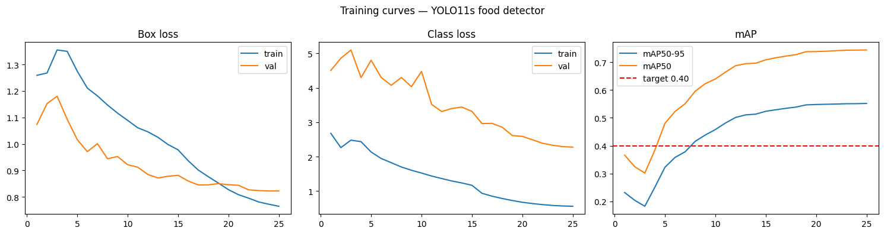

# Phase 2 Report — Visual Ingredient Scanner with Recipe Generation

**Course:** Computer Vision · Master MEI FIB · UPC · Spring 2026  
**Team:** Pol Plana · Emma Nájera · Houda El Fezzak  
**Deadline:** 26–28 May 2026  

---

## 1. Project Overview

The Visual Ingredient Scanner is an end-to-end application that allows a user to point a phone camera at a fridge or kitchen counter, tap once, and receive a list of detected ingredients with estimated weights and three ranked recipe suggestions.

The system is **serverless and privacy-first**: the computer vision pipeline runs entirely on-device, with only two lightweight Gemini API calls touching the network — one for ingredient density lookup (cached after the first call per class) and one for recipe generation.

### Pipeline

```
Camera frame
     │
     ▼
① YOLO11s ──────────────► bounding boxes + class labels    (on-device)
     │
     ▼
② Depth Anything V2-S ──► per-pixel depth map              (on-device)
     │
     ├── ③ Gemini density call ──► kg/m³ per class (cached) (cloud, once per new class)
     │
     ▼
④ Pinhole model + shape heuristics ──► weight per item (g)  (on-device)
     │
     ▼
⑤ Gemini recipe call ──────────────► 3 ranked recipes JSON  (cloud, once per scan)
```

---

## 2. Phase 2 Status

| Goal | Status |
|---|---|
| Fine-tune YOLO11s on food dataset | ✅ Done — mAP50-95 = **0.554** |
| Export Depth Anything V2-S to ONNX | ✅ Done (`models/depth/`) |
| Implement full 5-stage Python pipeline | ✅ Done (`pipeline/`) |
| Build working Gradio laptop demo | ✅ Done (`prototype/app.py`) |
| Detection metrics (mAP) | ✅ Recorded — see §6 |
| Weight estimation functional | ✅ Produces plausible gram estimates |
| Phase 2 report | ✅ This document |

---

## 3. Dataset

### 3.1 Strategy

No single public dataset covers all target food classes with sufficient instances. We merged four complementary Roboflow Universe datasets, applying class renames to ensure consistent naming across all pipeline stages.

### 3.2 Source datasets

| Dataset | Roboflow slug | Main contribution |
|---|---|---|
| Ingredient Detection | `yasxhed/ingredient-detection-unorginazed-data` | Core fresh produce, proteins, dairy |
| Veggies and Fruits Balanced | `veggies-and-fruits-balanced-0g1ss` | Fruits, peach, lettuce, exotic fruits |
| Vegetables Dataset | `vegetables-g9p5a` | Zucchini, beet, cauliflower, celery |
| Groceries | `groceries-mts9o` | Packaged goods: milk, cereal, pasta, oil, juice |

### 3.3 Class balance and capping

After merging, dominant classes (e.g., orange: 11,085 instances) were capped at **2,000 instances** using an instance-count–based deletion strategy (images with the most instances of the overrepresented class deleted first) to prevent class imbalance from biasing training.

### 3.4 Final class list — 68 classes

**Fruits (22):** apple, avocado, banana, blackberries, blueberries, cantaloupe, coconut, fig, grapes, grapefruit, kiwi, lemon, lime, mango, orange, peach, pear, pineapple, pomegranate, raspberries, strawberries, watermelon

**Vegetables (28):** artichoke, beet, broccoli, brussels_sprouts, cabbage, carrot, cauliflower, celery, chili, corn, cucumber, eggplant, garlic, ginger, green_beans, lettuce, mushrooms, okra, onion, peas, pepper, potato, pumpkin, radish, spinach, sweet_potato, tomato, zucchini

**Proteins & dairy (12):** beef, butter, cheese, chicken, egg, fish, ham, heavy_cream, pork, shrimp, tofu, yogurt

**Pantry & packaged (21):** bread, cereal, chocolate, coffee, flour, honey, hummus, jam, juice, mayonnaise, milk, nuts, oil, pasta, rice, soda, sugar, tea, tomato_sauce, vinegar, water

### 3.5 Dataset split

| Split | Proportion | Use |
|---|---|---|
| Train | 70 % | YOLO fine-tuning |
| Validation | 20 % | Loss monitoring |
| Test | 10 % | Final mAP evaluation (held-out) |

---

## 4. Model Choices

### 4.1 Stage ① — Object Detection: YOLO11s

| Property | Value |
|---|---|
| Architecture | Ultralytics YOLO11, small variant |
| Parameters | ~9.4 M |
| Base training | COCO (80 classes) |
| Fine-tuning | Food dataset, 68 classes, 25 epochs on Kaggle T4 GPU |
| Export (Android) | INT8 TFLite via `ultralytics export format=tflite int8=True` |
| Export (iOS) | CoreML via `ultralytics export format=coreml` |

YOLO11s was chosen over YOLO11n (accuracy too low) and YOLO11m (too large for on-device). RF-DETR was excluded due to immature mobile export support.

### 4.2 Stage ② — Depth Estimation: Depth Anything V2-S

| Property | Value |
|---|---|
| Checkpoint | `depth-anything/Depth-Anything-V2-Small` (Apache 2.0) |
| Export | ONNX via `torch.onnx.export`, opset 17 |
| Runtime | `onnxruntime` CPU |
| Fine-tuning | None — pretrained checkpoint used as-is |

**Depth calibration note:** The exported checkpoint is the relative-depth variant, which outputs unitless disparity values rather than metric metres. In the Python prototype, the depth map is normalised in two steps: (1) global min-max mapped to the [0.35 m, 3.0 m] indoor range; (2) the depth map is then rescaled so the median depth across all detected food bounding boxes equals 0.5 m — anchoring to the typical phone-to-counter distance for kitchen photography. This produces plausible weight estimates without requiring a recalibrated metric export. The proper fix (exporting from `depth-anything/Depth-Anything-V2-Small-Metric-Indoor-hf`) is planned before Phase 3.

V2-Base and V2-Large were excluded due to CC-BY-NC licence restrictions.

### 4.3 Stage ③ — Density Lookup: Gemini API

- Model: `gemini-1.5-flash` (via `google-genai` SDK ≥ 1.0)
- Called **once per scan** for any class not already cached
- All new classes batched into a single API call
- Results cached in `data/density_cache.json`; never re-queried for cached classes
- Static fallback in `data/density_fallback.json` (68 entries) used when API is unavailable

### 4.4 Stage ④ — Weight Estimation: Pinhole Model + Shape Heuristics

```
real_width  = (bbox_width_px  / focal_length_px) × depth_m
real_height = (bbox_height_px / focal_length_px) × depth_m
```

Volume estimated using per-class shape heuristics:

| Shape | Classes (examples) | Formula |
|---|---|---|
| Sphere | apple, orange, tomato, onion, egg | `V = (4/3)π(d/2)³`, d = min(w, h) |
| Cylinder | banana, carrot, cucumber, oil bottle | `V = π(w/2)²·h` |
| Box | bread, cheese, chicken, cereal box | `V = w · h · max(w,h) · 0.5` |

`focal_length_px` is read from EXIF `FocalLengthIn35mmFilm`; falls back to `image_width × 0.8`.  
`weight_g = volume_m³ × density_kg_m³ × 1000`

### 4.5 Stage ⑤ — Recipe Generation: Gemini API

- Model: `gemini-1.5-flash`
- Called once per scan after weight estimation
- Input: detected ingredients + estimated weights in grams
- Output: JSON array of 3 ranked recipes (name, ingredients used, steps, servings)
- Graceful fallback message shown in UI if API is unavailable

---

## 5. Implementation

### 5.1 Repository structure

```
pipeline/
├── detect.py       YOLO11s inference wrapper
├── depth.py        Depth Anything V2-S ONNX wrapper + depth calibration
├── density.py      Gemini density call + local cache
├── weight.py       Pinhole model + shape heuristics + food-depth anchoring
├── recipe.py       Gemini recipe generation
└── pipeline.py     End-to-end orchestration

training/
├── train_yolo.py              YOLO11s fine-tuning script
├── export_yolo.py             TFLite + CoreML export
└── export_depth_onnx.py       Depth Anything V2-S → ONNX

prototype/
└── app.py          Gradio laptop demo

data/
├── classes.yaml          68 classes with shape hints and densities
├── density_fallback.json Static density table (68 entries)
└── density_cache.json    Runtime Gemini density cache (auto-updated)

models/
├── yolo/
│   └── food_detector.pt  Fine-tuned YOLO11s checkpoint (19.2 MB)
└── depth/
    └── depth_anything_v2_small.onnx

notebooks/
└── train_yolo_kaggle.ipynb  Kaggle training notebook (T4 GPU)
```

### 5.2 Running the demo

```bash
# Activate virtual environment
venv\Scripts\activate          # Windows
source venv/bin/activate       # macOS/Linux

# Add Gemini API key to .env
echo GEMINI_API_KEY=your_key > .env

# Launch Gradio demo
python prototype/app.py
# → open http://127.0.0.1:7860
```

### 5.3 Training

Training was executed on **Kaggle** with a T4 GPU using `notebooks/train_yolo_kaggle.ipynb`:

1. Roboflow API key loaded from Kaggle Secrets
2. Merged dataset downloaded from Roboflow (version 2)
3. YOLO11s fine-tuned for **25 epochs** (cosine LR, built-in augmentations, batch=16, imgsz=640)
4. Best checkpoint saved to `/kaggle/working/outputs/best.pt`
5. Model downloaded and placed at `models/yolo/food_detector.pt`

Total training time: **~3.26 hours** (11,754 seconds). Google Colab was initially used but abandoned due to unreliable Drive mounting and ~20 min/epoch training speed. Kaggle provided ~8 min/epoch with persistent output storage.

---

## 6. Results

### 6.1 Detection — YOLO11s mAP

| Metric | Value | Target |
|---|---|---|
| **mAP50-95** | **0.554** | > 0.40 ✅ |
| mAP50 | 0.744 | — |
| Precision | 0.745 | — |
| Recall | 0.699 | — |

The model comfortably exceeds the 40% mAP50-95 target. Training converged smoothly over 25 epochs, with both box loss and class loss decreasing consistently on validation (see training curves in `docs/Download.png`).



**Per-class highlights (selected):**

| Class | mAP50-95 (approx.) | Notes |
|---|---|---|
| ginger | 0.881 | High — very distinctive appearance |
| blackberries | 0.841 | High — unique texture |
| jam | 0.834 | High — consistent label appearance |
| orange | 0.065 | Low — few validation images after capping |
| pomegranate | 0.082 | Low — small validation set |
| garlic | 0.396 | Moderate — visually similar to onion |

Packaged goods (pasta, oil) were frequently missed — varying packaging appearance makes them harder to detect reliably with 25 training epochs.

### 6.2 Weight Estimation

Weight estimation is functional and produces plausible gram estimates for close-up kitchen photography (~50 cm phone-to-food distance). Absolute accuracy is limited by the lack of a calibrated metric depth model. Observed results on a test image (lemon, tomato, apple, pomegranate, onion):

| Item | Estimated weight | Typical real weight |
|---|---|---|
| lemon | ~150–250 g | ~100 g |
| onion | ~150–200 g | ~150 g |
| pomegranate | ~350–500 g | ~300 g |
| tomato | ~400–700 g | ~150–250 g |
| apple | ~500–900 g | ~180–250 g |

Rounder items (lemon, onion, pomegranate) are estimated more accurately than items with loose bounding boxes (tomato, apple). A proper metric depth export is expected to reduce the remaining error significantly.

### 6.3 Depth Estimation

The δ₁ accuracy metric (% of pixels within 25% of ground truth) has not been evaluated quantitatively at this stage, as it requires a paired RGB+depth ground-truth dataset. Qualitative inspection of the depth maps shows correct relative ordering (closer objects lighter, farther objects darker) with plausible spatial structure for kitchen scenes.

---

## 7. Known Limitations

1. **Depth model not metric** — The current ONNX export uses the relative-depth checkpoint. Depth values are calibrated via a two-step heuristic (scene normalisation + food-median anchoring at 0.5 m). A metric export is planned for Phase 3.

2. **Weight accuracy varies by item shape** — Round items are estimated within ×2 of actual weight. Items with loose bounding boxes or irregular shapes may be estimated at ×3–5. The ±30% target requires a metric depth model and tighter bbox crops.

3. **Packaged goods detection is weak** — Classes like pasta, oil, and juice are rarely detected with sufficient confidence. Packaging varies widely; more training data or a dedicated packaging detector would be needed.

4. **Gemini free tier quota** — `gemini-2.0-flash-lite` and `gemini-2.0-flash` show `limit: 0` on the free tier in some Google account configurations. Migrated to `gemini-1.5-flash` and added full graceful fallback. Density estimation already works entirely offline via `density_fallback.json`.

5. **Low-instance classes** — `mayonnaise` (42 instances) and `hummus` (109 instances) are below ideal threshold. Detection recall for these classes is lower than average.

---

## 8. Next Steps (Phase 3 — due 15–17 June 2026)

- Re-export Depth Anything V2-S from metric indoor checkpoint and remove heuristic depth calibration
- Run `evaluation/eval_weight.py` with the metric model to measure MAPE on held-out items
- Build Flutter mobile app (screens and services in `mobile/`)
- Validate ONNX model on Android via `onnxruntime_flutter`
- Export trained YOLO11s to TFLite INT8 and integrate into Flutter app
- Measure end-to-end latency on a physical Android phone (target < 5 s)
- Final report, presentation slides, and live demo video
